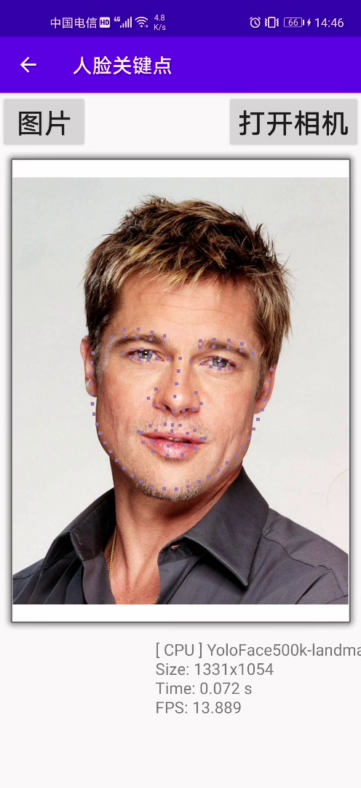

# learn_android
## 1、score:计分器面板app，
      知识点：保持app退出数据不丢失
      
## 2、math_game:口算测试app
      知识点：Fragment页面切换

## 3、AIDemo
     功能：
     ## 图像分类：
     （初步完成，将代码全部写在ClassififcationFragment中）2021-03-24
      权限设置在AndroidManifest.xml文件中
     ## 目标检测 ：
     （使用nanodet完成目标检测，后端为MNN，其中jni文件路径不能有大写字母）2021-03-26
     ## 超分辨率 ：
     （使用SRGAN实现，后端为tflite，为了能够运行，将大图切分为小图依次运行，最后拼接）2021-03-30
     ## 风格迁移:
     (使用adain网络实现，后端为tflite,网络运行中取整的问题，通过放缩图片到512 X 512解决) 2021-04-08
     ## 人脸关键点，人体关节检测：
     (完成，后端为NCNN)
     ## 中文OCR检测（参考chineseocr lite）  2021-04-30
     初步以NCNN完成功能，java代码, 其中NCNN版本 > 20210124  

ToDo: 利用MNN完成OCR功能

> Android AIDemo界面

| 主页面 | 图像分类 | 目标检测 |
|-------------------|-------------|---------|
||||

| 超分辨率 | 风格迁移 | 人脸关键点检测 |
|-------------------|-------------|---------|
||||

| 人体关节检测 | OCR检测 | OCR识别 |
|-------------------|-------------|---------|
||||